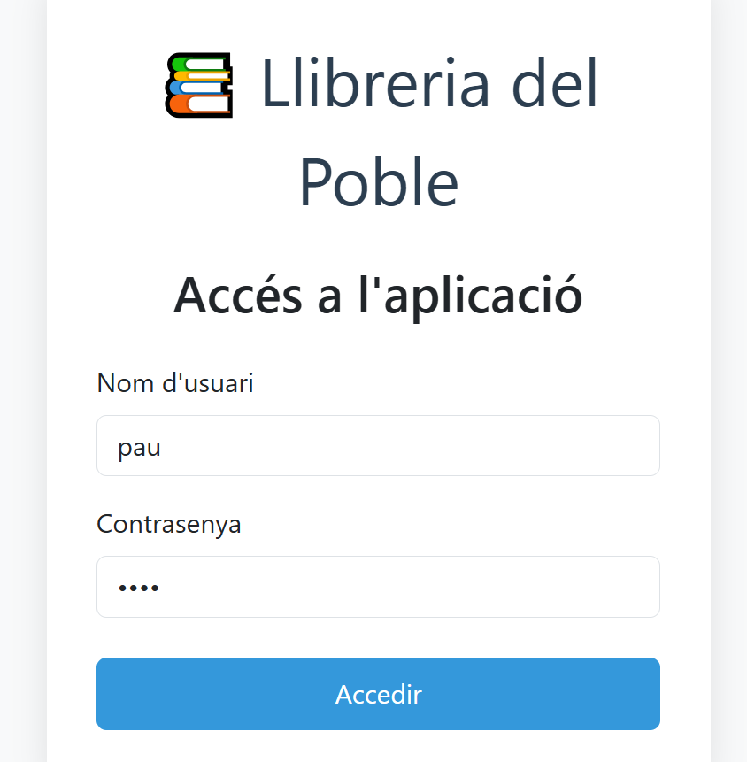
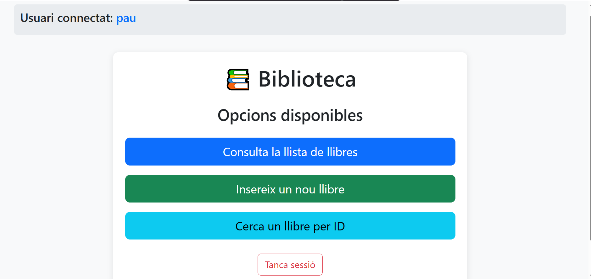
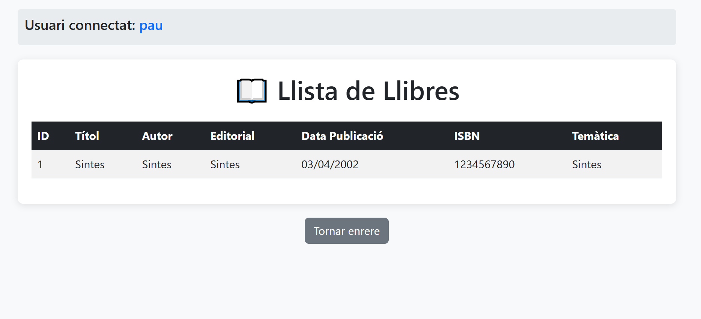
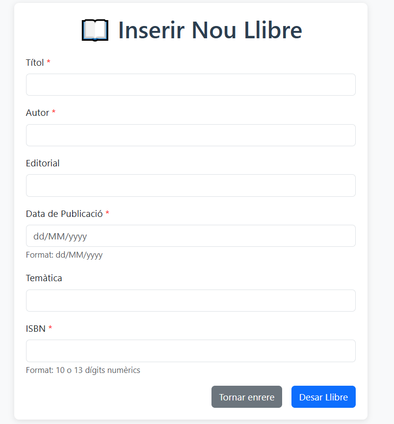
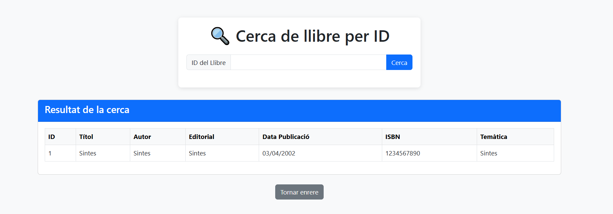

# A02: Cambiem l'accés a dades de l'aplicació MVC library 

Al README.md cal que documenteu les proves que feu. No cal que expliqueu cap funcionament de l’aplicació a menys que feu cap cosa diferent a la proposada (i que sigui correcta i hagueu entès).

## Entrem com a usuari Pau

## Menú disponible

## Llibres disponibles

## Inserir un nou llibre

## Cercar un llibre per id

# Algunes preguntes de reflexió:

## Per què al servei estem utilitzant mètodes que no hem declarat explícitament al repositori? Com és possible?

Perquè el repositori exten de JpaRepository i Spring genera automàticament mètodes estàndars com finById(), findAll().

## El repositori pot elegir fer l’extends de les interfícies PagingAndSortingRepository o de JpaRepository. En què es diferencien aquestes dues amb la interfície CrudRepository?

CrudRepository té mètodes bàsics de CRUD per fer operacions simples sense paginació. En canvi PagingAndSortingRepository afegeix peginació i ordenació. I JpaRepository és una combinació dels 2 i ademés afegeix mètodes extra.

## Què significa Optional<Classe> i per a què serveix?

Optional es un contenedor de Java que indica que algo null o no null i serveix per evitar el NullPointerException.

## Per què el controlador utilitza el servei i no la seva implementació? 
Per fer una bona arquitectura per capes. El Controlador gestiona peticions HTTP. No ha de contenir lògica de negoci. El Servei conté la lògica de negoci. El repositori només accedeix a la base de dades (operacions CRUD).
